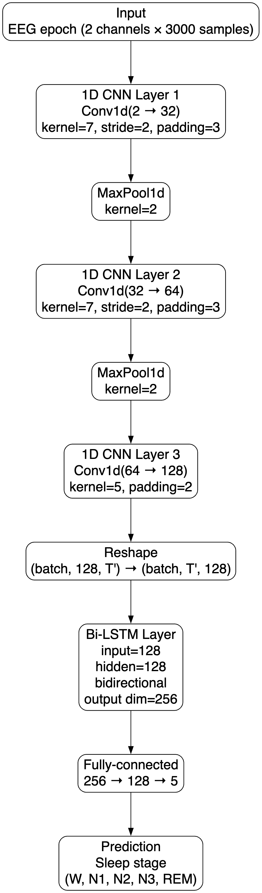
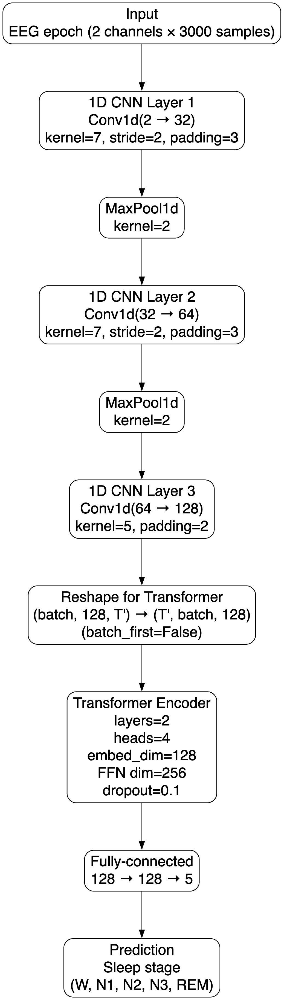
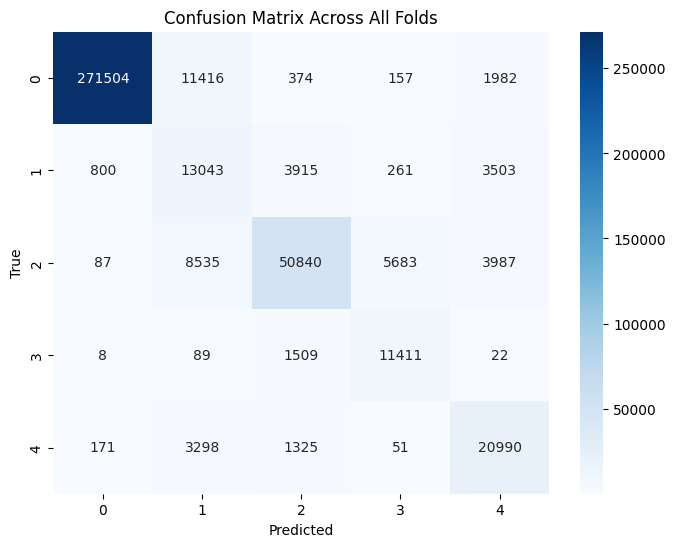

# Sleep Stage Classification Using CNN-LSTM and CNN-Transformer (Sleep-EDFx)

This project performs automated sleep stage classification on the Sleep-EDFx Sleep Cassette dataset, using two deep learning architectures:

- CNN-LSTM
- CNN-Transformer

The goal is to compare the two architectures fairly, using identical preprocessing, training, and evaluation pipelines, while addressing the strong class imbalance present in sleep EEG.

This repository includes:

- Full preprocessing pipeline (channel extraction, bandpass filter, data cleaning)
- Five-fold cross-validation
- Class imbalance mitigation
- CNN-LSTM & CNN-Transformer architectures
- Confusion matrices, classification reports, and per-class evaluation
- Comparison of architectures

This project achieves research-grade performance (Macro-F1 ≈ 0.74), comparable to DeepSleepNet and other published baselines.

---

## Dataset: Sleep-EDFx (Sleep Cassette)

This project uses the Sleep Cassette (SC) subset from Sleep-EDFx, containing:

- 153 full-night PSG recordings
- EEG channels: Fpz-Cz, Pz-Oz (100 Hz sampling rate)
- Hypnograms with stages: W, N1, N2, N3 (merged stage 3 + 4), REM
- Note: During preprocessing I found out that there is significant imbalance in the dataset, with Wake dominating the data, while N1 and N3 are rare

**Steps:**

1. Download the dataset manually from PhysioNet:
https://physionet.org/content/sleep-edfx/1.0.0/

2. Place the PSG and Hypnogram files under:
raw_data/

---

## Preprocessing Pipeline

Preprocessing code is found under pipeline/preprocess_data.ipynb

The pipeline includes the following operations:

1. Load EDF PSG recordings (extract EEG only)
2. Select EEG channels: Fpz-Cz and Pz-Oz
3. Bandpass filter: 0.3–35 Hz
4. Split EEG signals into 30s epochs (to match with the manual labels)
5. Align hypnogram labels to each epoch + map stages to integers (W=0, N1=1, N2=2, N3=3, REM=4)
6. Remove unwanted data (movement artifacts (M) and unknown (?) labels)
7. Normalize each epoch (per-channel): x = (x - mean) / std
8. Handle class imbalance using class-weighted loss
9. Save X.npy and y.npy (≈10 GB total)

The final output shapes is as follows:

- X: (414,961 epochs, 2 channels, 3000 samples)
- y: (414,961,)

--- 

## Model

We compare two architectures under identical pipelines.

**Model Architecture: CNN-LSTM**

**Model Architecture: CNN-Transformer**

Model training code:
- CNN-LSTM: pipeline/train_cnn_lstm_ipynb
- CNN-Transformer: pipeline/train_cnn_transformer.ipynb

---

## Results

**CNN-LSTM Performance**
Mean Accuracy: 0.886
Mean Macro F1: 0.743

Per-class F1:
- Wake: 0.97
- N1: 0.45
- N2: 0.80
- N3: 0.75
- REM: 0.75

Confusion Matrix:

**CNN-Transformer Performance**
Mean Accuracy: 0.883
Mean Macro F1: 0.741

Per-class F1:
- Wake: 0.97
- N1: 0.44
- N2: 0.81
- N3: 0.76
- REM: 0.74

Confusion Matrix:

**Interpretation**

- Both models achieve ~0.74 macro F1
- CNN-LSTM performs slightly better on recognizing N1 stage
- Transformer performs slightly better on recognizing N3 stage
- Wake, N2, and REM performance is nearly identical

Conclusion:
Transformers do not outperform LSTMs when given only single-epoch EEG input. Transformers need multi-epoch temporal context to win convincingly.

--- 

## How to Run

1. Create a virtual environment:

python3 -m venv venv
source venv/bin/activate
pip install -r requirements.txt

2. Download the Sleep-EDFx dataset from https://physionet.org/content/sleep-edfx/1.0.0/ and place under raw_data/

3. Run preprocessing using pipeline/preprocess_data.ipynb

4. Train the models using pipeline/train_cnn_lstm,ipynb and pipeline/train_cnn_transformer.ipynb

5. Visualize results in results/
